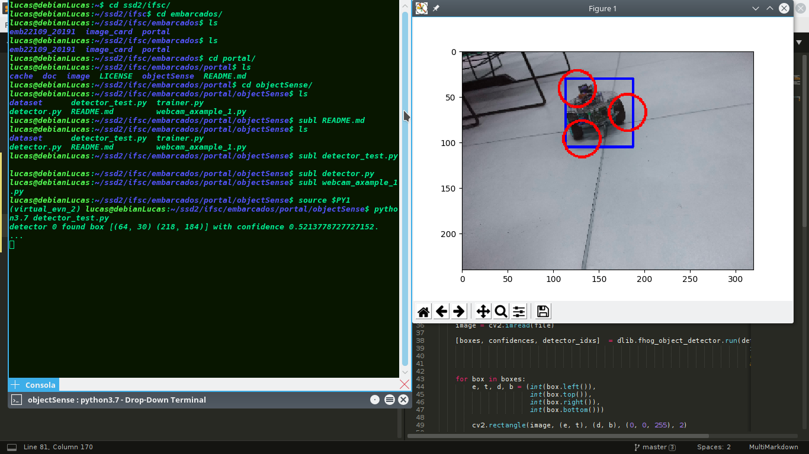

# Dlib - Detecção do Robo

Uma possível e simples solução para o reconhecimento da posição do robo na imagem oriunda da webcam é o algorítimo SVM (Support Vector Machine). 
Logo para a utilização desse algorítimo é necessário duas etapas, etapa de treinamento e etapa de operação.

### Treinamento:

Devido a demanda processamento, essa etapa é executada no PC. O algorítimo de treinamento necessita ser alimentado por um dataset de imagens junto a um arquivo XML que contém as marcações de cada imagem do que é pertinente para o algorítimo de treinamento. Para a geração do arquivo XML existe a ferramenta [ImgLab](https://lpae.github.io/estudos/ObjectSensing/ImgLab/). 

Quando as imagens que compoem o dataset possuem uma resolução demasiadamente alta, isso pode afetar o desempenho do ImgLab e do algorítimo de treinamento. Para resolver esse problema o script python [downsize.py](https://github.com/lsmanoel/portal/blob/master/objectSense/dataset/2019-06-26/python_aux/downsize.py), por meio do método da biblioteca OpenCV [cv2.resize()](https://docs.opencv.org/2.4/modules/imgproc/doc/geometric_transformations.html?highlight=resize#cv2.resize) foi feito para diminuir a resolução de um determinado dataset. 

No caso do [dataset](https://github.com/lsmanoel/portal/tree/master/objectSense/dataset/2019-06-26) utilizado nesse projeto, foi gerado o arquivo XML [robot_lowsize_imglab.xml](https://github.com/lsmanoel/portal/blob/master/objectSense/dataset/2019-06-26/lowsize/robot_lowsize_imglab.xml). Existe também um arquivo com o projeto do ImgLab [project_lowsize_imglab.nimn](https://github.com/lsmanoel/portal/blob/master/objectSense/dataset/2019-06-26/lowsize/project_lowsize_imglab.nimn).

Para o treinamento foi implementado o script [trainer.py](https://github.com/lsmanoel/portal/blob/master/objectSense/trainer.py)

### trainer.py
```python 
import os
import sys
import dlib

#===============================================================================
print("svn_options ...")
svn_options = dlib.simple_object_detector_training_options()

#-------------------------------------------------------------------------------
# During training stage: This option flip the input image. 
# This helps it get the most value out of the training data.
svn_options.add_left_right_image_flips = True

#-------------------------------------------------------------------------------
# The trainer is a kind of support vector machine and therefore has the usual
# SVM C parameter.  In general, a bigger C encourages it to fit the training
# data better but might lead to overfitting.  You must find the best C value
# empirically by checking how well the trained detector works on a test set of
# images you haven't trained on.  Don't just leave the value set at 5.  Try a
# few different C values and see what works best for your data.
svn_options.C = 5

#-------------------------------------------------------------------------------
# Set how many CPU cores your computer has for the fastest training.
svn_options.num_threads = 3

#-------------------------------------------------------------------------------
# Verbose Mode
svn_options.be_verbose = True

print("ok!")

#===============================================================================
print("path load ...")
dataset_folder_path = "./dataset/2019-06-26/lowsize/"
training_xml_path = os.path.join(dataset_folder_path, "robot_lowsize_imglab.xml")
svn_path = os.path.join(dataset_folder_path, "detector.svm")
landmarks_path = os.path.join(dataset_folder_path, "landmarks.dat")

print("ok!")

#===============================================================================
print("training svn ...")
dlib.train_simple_object_detector(training_xml_path, 
                                  svn_path, 
                                  svn_options)

print("ok!")

#===============================================================================
print("training landmarks ...")
landmarks_options = dlib.shape_predictor_training_options()

dlib.train_shape_predictor(training_xml_path, landmarks_path, landmarks_options)

print("ok!")

```

Como pode ser observado no script apresentado acima, detector basicamente é composto de um preditor de forma ("landmarks.dat") e o classificador SVM ("detector.svm"). Esses arquivos serão gerados durante o processe de treinamento.

### Testando o detector:

Com o script [detector_test.py](https://github.com/lsmanoel/portal/blob/master/objectSense/detector_test.py) é possível verificar se o processo de treinamento funcionou. Esse script aplica a detecção em cima do dataset para que seja possível verificar se a detecção está acontecendo corretamente. Para um teste mais refinado é recomendado que haja uma separação entre o dataset de treinamento e teste. Mas aplicar o teste em cima do dataset de treinamento valida de forma simplificada o funcionamento do detector.



### Testamdo a Webcam:

Para manipular a Webcam foi utilizado o OpenCV, uma vez que essa biblioteca fornece uma boa integração com os drivers do pacote [Video4Linux](https://www.kernel.org/doc/html/latest/media/v4l-drivers/index.html).

Com o script [webcam_example_1.py](./webcam_example_1.py) é possível testar o OpenCV e funcionamento da Webcam e seu respectivo driver.

### Detector:

O script [detector.py](./detector.py) é composto de uma estrutura de laço fechado (while 1) com um comando de trigger disparado pela tecla Enter. A ideia é posteriormente associar esse sistema de trigger ao sistema de ultrasom. Logo quando o trigger for acionando pelo ultrasom, uma imagem é capturada pela Webcam e a detecção é efetuada em cima dessa imagem. Dessa forma é evitado processamento de imagens quando nenhum carro estiver cruzando a linha de chegada.

```python 
import os
import sys

import cv2
import dlib

dataset_folder_path = "./dataset/2019-06-26/lowsize/"
svn_path = os.path.join(dataset_folder_path, "detector.svm")
landmarks_path = os.path.join(dataset_folder_path, "landmarks.dat")

detector = dlib.fhog_object_detector(svn_path)
landmarks_detector = dlib.shape_predictor(landmarks_path)

capture = cv2.VideoCapture(1)

def printLandmark(image, landmarks, color):    
    for p in landmarks.parts():
        cv2.circle(image, (p.x, p.y), 20, color, 2)
        
# ====================================================================================================================  
while 1:
    ret, frame = capture.read()

    [boxes, confidences, detector_idxs]  = dlib.fhog_object_detector.run(detector, 
                                                                         frame, 
                                                                         upsample_num_times=1, 
                                                                         adjust_threshold=0.0) 
    for box in boxes:
        e, t, d, b = (int(box.left()), 
                      int(box.top()), 
                      int(box.right()), 
                      int(box.bottom()))
        
        cv2.rectangle(frame, (e, t), (d, b), (0, 0, 255), 2)
        
        landmark = landmarks_detector(frame, box)
        printLandmark(frame, landmark, (255, 0, 0))

    cv2.imshow("Video", frame)

    # ------------------------------------------------------------------------------------------------------------------
    # Esc -> EXIT while
    while 1:
      k = cv2.waitKey(1) & 0xff
      if k ==13 or k==27:
        break

    if k == 27:
        break
    # ------------------------------------------------------------------------------------------------------------------
# ====================================================================================================================

capture.release()
cv2.destroyAllWindows()
```